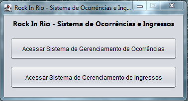
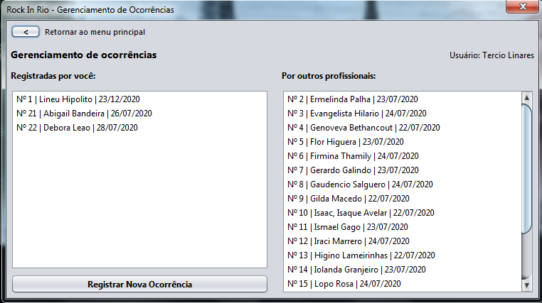
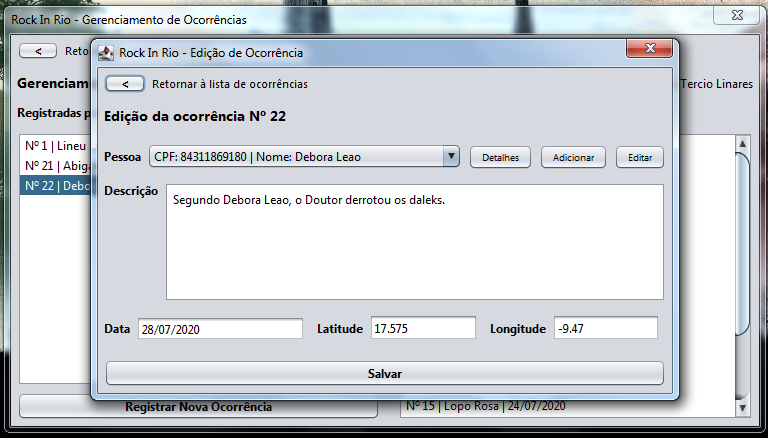
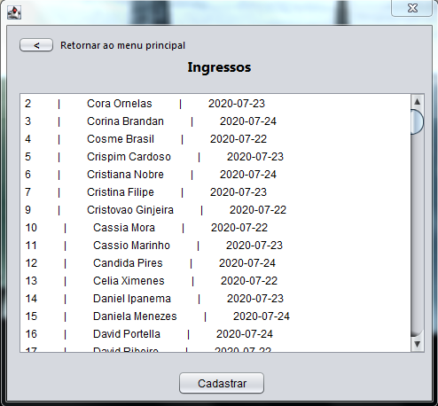
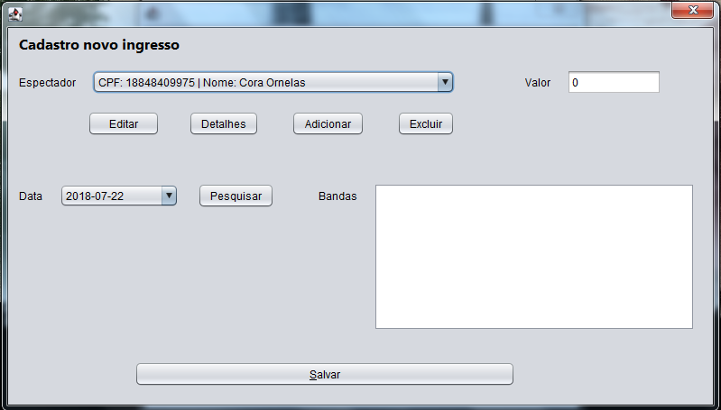

# Rock In Rio Project

Projeto de conclusão das disciplinas de BD e POO (Ciência da Computação/IFNMG).

## Sobre

O projeto é um sistema fictício para o evento Rock In Rio.  Entretanto, o sistema limita-se somente ao gerenciamento de ocorrências e ingressos, possibilitando a criação, edição, deleção e visualização destes. Durante o processo de criação e edição de ocorrências e ingressos, também é possível realizar a criação e edição de cadastros de pessoas.

Para saber mais sobre o projeto, veja a [apresentação em vídeo](https://youtu.be/n8WIeDeUInY).

## Ferramentas Utilizadas

- Ambiente de desenvolvimento: Apache Netbeans IDE 12.0;
- Driver de conexão com o banco de dados Oracle: ojdbc6.jar;
- Ferramenta de compilação e projeto: Apache Maven 3.6.3;
- Linguagem de programação: Java com o OpenJDK 15.

## Como Executar

1. Instale o OpenJDK 15.
2. Instale o driver de conexão com o banco de dados Oracle, caso ainda não tenha instalado (o arquivo .jar do driver pode ser encontrado no .zip onde esse documento foi encontrado).
3. Configure o arquivo db.properties (diretório \<raiz-do-projeto\>/src/main/resources/db.properties) com os seus dados de acesso ao servidor de banco de dados Oracle. A tag *url* recebe a url de conexão com o servidor de banco de dados, enquanto o *user* e *password* tratam-se, respectivamente, do seu usuário e senha de acesso ao banco de dados.
4. Realize o build do projeto e execute-o através da linha de comando ou de sua IDE de preferência.

## Screenshots

